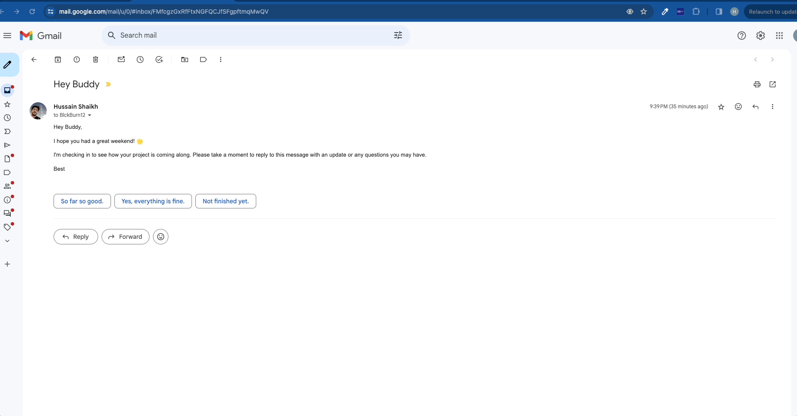

# Reply Buddy 👾

## Idea

The idea is to create a Chrome extension that provide users with AI generated email reply templates.

## Approach

Currently, the extension only supports gmail. When implementing i faced issues to access the user email data in client side. one approach was to use the gmail API which creates a complexity and can get pretty slow to get the user email. And there is no official gmail client API for frontend. i came across this cool library https://github.com/KartikTalwar/gmail.js this library just intercepts  the gmail request which has the email data which can be used to access the user email. My gmail interception code is here [injected.js](https://github.com/Hussainzz/reply-buddy/blob/main/src/contentScript/injected.js)

## AI Reply Template generation

For now i am relying on Open AI's GPT-4 API to generate the email templates.

## Demo

